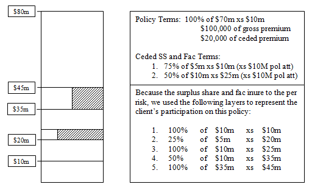

## Hi, try some picture and Math formulas

---

### All images should be stored and refereced from \public\images\

### Formulas will use &#36; or &#36;&#36;. If you need a regular dollar sign in your markdown, try to use "$\&\char"0023 36;$".
  
 
 

This is inline math formular  $\int_0^1f(x)dx = 1$ blah blah  
blah  blah  blah  blah blah  blah  blah  blah  blah  blah  blah  blah  

And this is display math formula

$$f(x)  = \frac{1}{\sigma\sqrt{2\pi}}e^{-\frac{1}{2} (\frac{x-\mu}{\sigma})}$$  

$$E = mc^2$$
