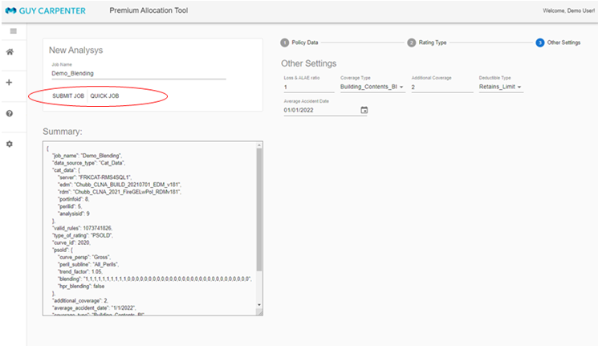

## User's Guide

---

### **The Input Data**

The tool supports three types of input data
1. A policy list include the terms and premium, with an unique policy id for each policy
1. A location list with each location contains the policy it associated, TIV, ocucpancy type, etc.
1. Optionally a list of FAC treaties that apply to locations

There are three ways to input the data into the tool: 
1. RMS EDM (with optinally a Spider analysis in RDM): This will capture the most detailed information include the policy conditions, fac coverage, etc. This is the prefered way to input data to the tool.
1. Reference to a previous PAT analysis if the base data is the same and the only change is the rating type and parameters, default rating group, blending, etc.
1. User input files in CSV or Excel format:
    * **Policy**: A simple list of the policy terms with an identifier.
        * `PolicyID`: Identify the original policy.
        * `Limit`: Policy limit.
        * `Retention`: Policy Retention.
        * `Participate`: Policy participation 
        * `LossRatio`: Polcy loss ratio, can keep as "null" then when fill in with the  rating parameter, eg., 80%
        * `PolPrem`: Original policy premium. 

    * **Location**: A list of locations with TIV and policy identifier.       
        * `LocID`: This column is used to match back the results with original input data. 
        * `PolicyID`: Identify the original policy.
        * `AOI` or `TIV`: TIV or AOI depend on the selected rating type. set up parameters specify a fixed loss ratio, say, 1.
        * `Stack`: Stack identifier when consider reinsurance. use LocID if you don't have any other input 
        * `RatingGroup`: In PSOLD case this is the rating group mapped from occupancy. Otherwise can be "null" and will set by the parameters
    
    * **PsudoPolicy**: Use this as an alternative to input policy and location seperatly. A PsudoPolicy is a record from joining the policy table with location table. A `PsudoPolicyID` is created from the join. Beside the columns in the above policy and location table, the following columns can be added in the input as well:
        * `PseudoPolicyID`: Record identifier.
        * `ACCGRPID`: Optional
        * `PolRetainedLimit`: Policy retained limit
        * `PolLimit`: Policy limit.
        * `PolRetention`: Policy Retention.
        * `occupancy_scheme`: Optional  
        * `occupancy_code`: Optional
        * `Building`: Building value of the location
        * `Contents`: Contents value of the location
        * `BI`: BI value of the location
    
    * **Fac**: Optional. This input a list of Fac treaties apply to the policy location. If policy and location are input seperatly, this file have to include "`PolicyID`" and "`LocID`". If PsudoPolicy list is the input, then "`PsudoPolicyID`" have to be included.i
        * `FacKey`: Sequential number to identify each record
        * `PseudoPolicyID`: or "`PolicyID`" and "`LocID`"
        * `FacLimit`: Fac limit
        * `FacAttachment`: Fac Attachment
        * `FacCeded`: FAC ceded %

We can zip all the user file(s) before input to the tool to speed up the file transfer to the server. 

### **The Rating Types**

The PAT tool support several kind of rating types
1. The PSOLD curves include 2016 and 2020 curves. PSOLD 2016 curve only support "Building+Contents+BI" and "Building+Contents" coverage type. PSOLD 2020 supports "Building Only" and "Contents Only."     
1. FLS curves include an entry for user defined
1. MB curves include an entry for user defined

When use PSOLD and if the rating group mapped from occupency is not available, we can use blending option by provide a list of blending weights. If only once curve is used, this is the same as setting a default rating group for missing/invalid groups. In fact, this blending option can apply to all locations if a user choose to.

### **How to Use the Tool**

The tool is web based so no installation is required. It is easy to use. 

1. When open the tool url in a browser, you will the list of jobs has been run before. You can only see the jobs you created, plus a list of "public" demo projects that visible to all users.   

Fig.1 - Main page for job list 
(Can rerun, stop, and download from this page)

2. Click the "New Analysis" button on the left side bar then you can go to the "New Anlysis" page. From here you can select the input data, configure the rating type and parameters, then submit the job.     

Fig.2 - Input data 
(Can select to input data from Cat DB, reference job, or user defined)

Fig.2 - Input data 
(Can select can configure rating type from PSOLD, FLS, and MB)

Fig.2 - Input data 
(Final configuration and submit the job)

 
 

Once the job is submitted, it is sent to the backend server to calculate. You will stay in the same page and can make small modifications for the next job. You can submit multiple jobs in the same time and typically all will executed right away. We do set a maximum of execution (current is 5 in DEV server). The workers on the server will looking for unfinished jobs and start them. 

 
 
 
 

### Found bugs? It will be very helpful if you can send it to me! 
This is NORMAL😊:
$$f(x)  = \frac{1}{\sigma\sqrt{2\pi}}e^{-\frac{1}{2} (\frac{x-\mu}{\sigma})}$$  

