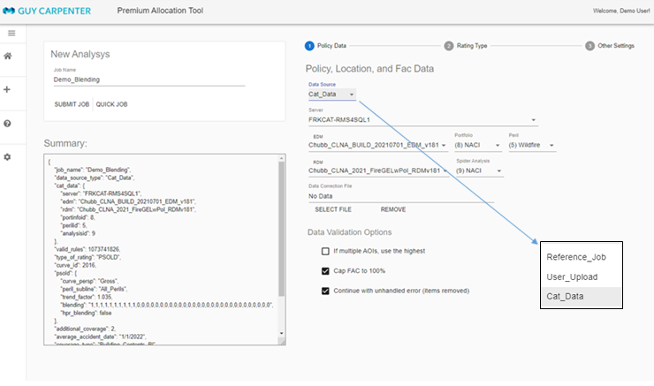

## User's Guide

---

### **The Input Data**

The tool supports three types of input data
1. A policy list include the terms and premium, with an unique policy id for each policy
1. A location list with each location the policy it associated, TIV, ocucpancy type, etc.
1. Optionally a list of FAC treaties that apply to each location

The put data can be input into the two with three kind of format:
1. RMS EDM (with optinally a Spider analysis in RDM to capture the layer limits)
1. User prepared file in CSV, Excel format. Optionally all files can be zipped to speedup the network transfer speed.
1. If a analysis has been run then new analyses can reference that previous one and use the same input data (with different rating options)

### **The Rating Types**

The PAT tool support several kind of rating types
1. The PSOLD curves include 2016 and 2020 curves. PSOLD 2016 curve only support "Building+Contents+BI" and "Building+Contents" coverage type. PSOLD 2020 supports "Building Only" and "Contents Only."     
1. FLS curves include an entry for user defined
1. MB curves include an entry for user defined

When use PSOLD and if the rating group mapped from occupency is not available, we can use blending option by provide a list of blending weights. If only once curve is used, this is the same as setting a default rating group for missing/invalid groups. In fact, this blending option can apply to all locations if a user choose to.

### **How to Use the Tool**

The tool is web based so it is easy to use. When open the tool url in a browser, you will see a list of jobs has been run. You can only see the jobs you created, plus a handful of demo projects that open to all users.   

Click the "New Analysis" button on the left side bar then you can go to the "New Anlysis" page. From here you can select the input data, configure the rating parameters, anf submit the job.     

#### Select the input data:

#### Select and configure rating type:

#### Other configuration and submit the job:

$$f(x)  = \frac{1}{\sigma\sqrt{2\pi}}e^{-\frac{1}{2} (\frac{x-\mu}{\sigma})}$$  

